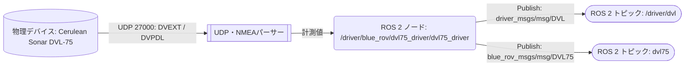

# dvl75_driver

Cerulean Sonar DVL-75のUDP計測値をROS 2トピックへ変換するC++ドライバー。`dvl75_driver`実行ファイルは、ロード可能なコンポーネント`dvl75_driver::Dvl75Driver`から生成。共通用途には既存の`driver_msgs/msg/DVL`、DVL-75固有の計測値には`blue_rov_msgs/msg/DVL75`を使用。デバイス固有の通信・永続設定は[README_DVL75.md](README_DVL75.md)を参照。

## 概要



`dvl`は`$DVPDL`の位置差分と`delta_time_us`から計算した共通の速度・高度をPublish。`dvl75`は、最新の`$DVEXT`と受信した`$DVPDL`を統合し、`$DVPDL`受信ごとに1回Publishする。DVLアドレス以外からのパケットは破棄。

## 前提条件・依存関係

- ROS 2 `rclcpp`、`rclcpp_components`
- `custom_socket`。UDP送受信、送信元取得、bind、タイムアウト処理
- `common_msgs`
- `driver_msgs`
- `blue_rov_msgs`
- DVL-75とUDP通信可能なネットワーク

ROSディストリビューションはワークスペースの既存install設定では`jazzy`を参照。実行環境では使用中のROSディストリビューションをsourceすること。

## ビルド・起動

```bash
cd <workspace>
source /opt/ros/$ROS_DISTRO/setup.bash
colcon build --packages-up-to dvl75_driver --symlink-install
source install/setup.bash
ros2 launch dvl75_driver dvl75_driver.launch.py
```

### 初期設定

DVLを初めて接続するときだけ、初期設定専用launchを実行する。

```bash
ros2 launch dvl75_driver dvl75_setup.launch.py
```

このlaunchは`apply_device_config=true`を明示的に上書きし、`SEND-DVEXT ON`と`SEND-DVPDL ON`、および設定ファイルで指定した初期コマンドを送信する。`DVPDL`受信を確認したら`Ctrl-C`で停止し、以後は通常の`dvl75_driver.launch.py`を使用する。通常起動ではDVLの永続設定を変更しない。初期設定launchと通常launchを同時に起動しないこと。

### launch構成

| launchファイル | 起動プロセス | ノード | 主な設定 |
| --- | --- | --- | --- |
| `launch/dvl75_driver.launch.py` | `component_container_mt` | コンテナ: `/driver/blue_rov/dvl75_driver/dvl75_driver_container`、ロードノード: `/driver/blue_rov/dvl75_driver/dvl75_driver` | 通常運用。永続設定を変更しない |
| `launch/dvl75_setup.launch.py` | `component_container_mt` | コンテナ: `/driver/blue_rov/dvl75_driver/dvl75_setup_container`、ロードノード: `/driver/blue_rov/dvl75_driver/dvl75_setup` | 初期設定専用。`apply_device_config=true`を上書き |

## ノードと通信

ノード名は`dvl75_driver`、launch時のnamespaceは`/driver/blue_rov/dvl75_driver`。共通型の相対Topic `dvl`は、launchファイルで機体に依存しない`/driver/dvl`へremapする。

| 種別 | 相対名 | launch時の完全名 | 型 | QoS・条件 |
| --- | --- | --- | --- | --- |
| Publish | `dvl` | `/driver/dvl` | `driver_msgs/msg/DVL` | KeepLast 10。`$DVPDL`受信ごと、または受信タイムアウト時 |
| Publish | `dvl75` | `/driver/blue_rov/dvl75_driver/dvl75` | `blue_rov_msgs/msg/DVL75` | KeepLast 10。最新DVEXTを統合し、`$DVPDL`受信ごとに1回 |
| Service | `command` | `/driver/blue_rov/dvl75_driver/command` | `driver_msgs/srv/Command` | DVLへ1行のASCIIコマンドをUDP送信 |

Subscribe・Actionは使用なし。

### Publishデータ

| フィールド | 型 | 内容 |
| --- | --- | --- |
| `header.stamp` | `builtin_interfaces/Time` | UDPパケットをホストが受信した直後のROS時刻。DVL内部計測時刻ではない |
| `header.frame_id` | `string` | `frame_id`パラメータ |
| `status.id` | `uint8` | 4ビームでNORMAL、3ビームでWARNING、ロック不足・信頼度不足・`DVEXT`欠落・不正なNMEA文・受信タイムアウトでERROR |
| `velocity` | `geometry_msgs/Vector3` | `position_delta / delta_time_us`。有効時のみ設定 |
| `velocity_valid` | `bool` | 底面ロック、ビーム数、信頼度、時間差の判定結果 |
| `altitude` | `float64` | 有効な`$DVEXT`からの高度[m] |

`DVL.msg`は変更しない。Pathfinder互換フィールド`system_config`、`leak_a`、`leak_b`、`btm_status_echo_amplitude`、`btm_status_correlation`、`velocity_error`はDVL-75では設定しない既定値。

### DVL-75専用データ

`dvl75`は`$DVPDL`受信ごとに1回Publish。`dvpdl_valid`は常に`true`で、`dvext_valid`は`dvext_timeout_s`以内の最新DVEXTを統合できたかを示す。

| フィールド群 | 型 | 内容 |
| --- | --- | --- |
| `dvext_valid`、`bottom_lock`、`data_skips` | `bool`、`bool`、`uint8` | `$DVEXT`受信有無、底面ロック、スキップ数 |
| `velocity_up`、`velocity_north`、`velocity_east`、`altitude` | `float64` | `$DVEXT`の速度・高度[m/s、m] |
| `beam_lock`、`beam_velocity`、`beam_range` | 配列 | 4ビームのロック、ビーム軸速度[m/s]、距離[m] |
| `dvpdl_valid`、`device_time_us`、`delta_time_us` | `bool`、`uint64`、`uint32` | `$DVPDL`受信を示す`true`、DVL時刻、前回からの時間差[µs] |
| `angle_delta`、`position_delta`、`confidence` | `geometry_msgs/Vector3`、`geometry_msgs/Vector3`、`uint8` | `$DVPDL`の差分[rad、m]へ軸符号を反映した値、信頼度 |

## パラメータ

全値を起動時に読む実装。動的変更コールバックなし。

| パラメータ | 型 | ソース既定値 | YAML設定値 | 内容 |
| --- | --- | --- | --- | --- |
| `dvl_address` | string | `192.168.2.3` | `192.168.2.3` | 受信元フィルタ兼コマンド送信先IP |
| `dvl_command_port` | integer | `50000` | `50000` | コマンド送信先UDPポート |
| `bind_address` | string | `0.0.0.0` | `0.0.0.0` | UDP受信bind先 |
| `listen_port` | integer | `27000` | `27000` | UDP受信ポート。1–65535 |
| `frame_id` | string | `dvl75_link` | `dvl75_link` | PublishフレームID |
| `timeout_s` | double | `1.0` | `1.0` | `$DVPDL`未受信ERRORまでの秒数。正値 |
| `dvext_timeout_s` | double | `1.0` | `1.0` | 最終`$DVEXT`を有効とみなす秒数。正値 |
| `validate_checksum` | bool | `true` | `true` | NMEAチェックサム検証 |
| `minimum_confidence` | integer | `50` | `50` | 速度有効とする最小信頼度。0–100 |
| `minimum_locked_beams` | integer | `3` | `3` | 最小ロックビーム数。3–4 |
| `position_axis_sign` | double[3] | `[1,1,1]` | `[1,1,1]` | 位置差分の軸符号。有限かつゼロ不可 |
| `angle_axis_sign` | double[3] | `[1,1,1]` | `[1,1,1]` | 角度差分の軸符号。有限かつゼロ不可 |
| `apply_device_config` | bool | `false` | `false` | 通常運用では永続設定を変更しない。初期設定launchだけが`true`へ上書き |
| `device_host_address` | string | 空文字 | 空文字 | `HOST-ADDRESS`へ渡す値 |
| `startup_commands` | string[] | `[]` | 未設定 | 追加で送信する1行コマンド列。DVEXT・DVPDLのOFFは指定不可。空の場合はYAMLから省略 |

## 起動後の確認

```bash
ros2 node info /driver/blue_rov/dvl75_driver/dvl75_driver
ros2 topic info /driver/dvl --verbose
ros2 topic hz /driver/dvl
ros2 topic echo /driver/dvl
ros2 topic echo /driver/blue_rov/dvl75_driver/dvl75
```

`velocity_valid`、`status.id`、`beam_lock`、`confidence`を確認対象。`SEND-DVPDL ON`後に`$DVPDL`が来ない場合、およびチェックサム・フィールド形式が不正なNMEA文を受信した場合は、`velocity_valid=false`かつERRORの共通`DVL`メッセージを出力。

## 運用・停止・テスト

- 初回設定時だけ`dvl75_setup.launch.py`を使用し、通常運用では`dvl75_driver.launch.py`を使用
- 軸符号は拘束状態で確認
- 停止はlaunch端末で`Ctrl-C`。ソケットを閉じ、受信スレッドをjoin
- パーサーテスト: `colcon test --packages-select dvl75_driver`

## 既知の制約

- UDP送信成功はDVLのコマンド受信確認ではない。`$DVPDL`受信を確認として扱う実装
- DVL本体の取付姿勢設定は本パッケージ外の設定
