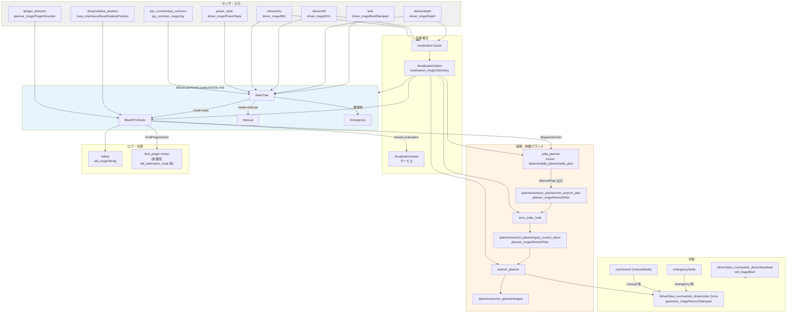
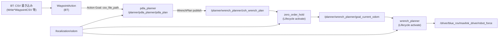
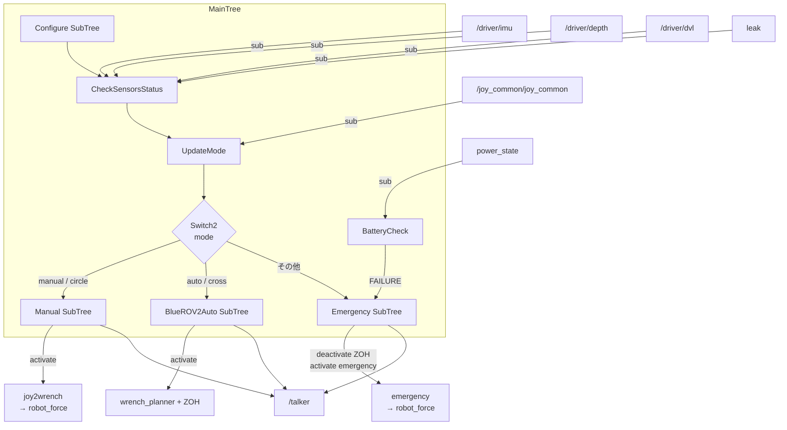
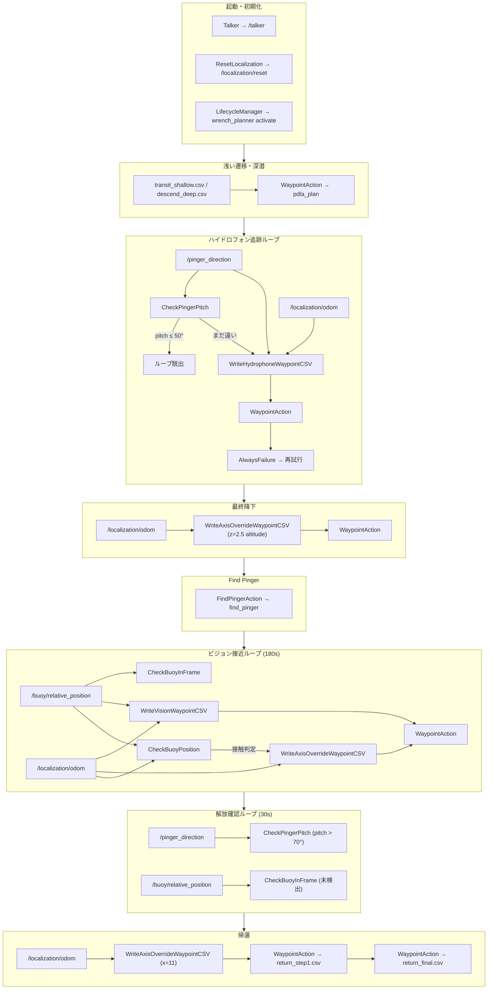

# iwakuni2026.xml トピック流れ

`behavior_tree/bt_xml/iwakuni2026.xml` が参照・発行する ROS 2 トピック／アクション／サービスの関係図。
BlueROV 向け起動は `bluerov_control_bt_nodes/launch/bluerov_bt.launch.py` を前提とし、
`btExecutorNode` の remapping を反映している。

## 全体アーキテクチャ

## 制御チェーン（Auto モード）

`WaypointAction` が PDLA に CSV を渡すと、目標値が PID 制御まで流れる。

## MainTree（モード切替）

## BlueROV2Auto フェーズ別トピック

ミッション進行に沿った購読・発行の対応。

## トピック一覧（XML 参照分）

| トピック / インターフェース | 型 | 方向 (BT から見て) | 使用ノード |
|---|---|---|---|
| `/talker` | `std_msgs/String` | pub | `Talker` (各フェーズの状態メッセージ) |
| `/localization/reset` | サービス | call | `ResetLocalization` |
| `/localization/odom` | `localization_msgs/Odometry` | sub | `Write*WaypointCSV`, `CheckBuoyPosition` 等 (`odom` → remap) |
| `/pinger_direction` | `planner_msgs/PingerDirection` | sub | `CheckPingerPitch`, `WriteHydrophoneWaypointCSV` |
| `/buoy/relative_position` | `buoy_interfaces/BuoyRelativePosition` | sub | `CheckBuoyPosition`, `WriteVisionWaypointCSV`, `CheckBuoyInFrame` |
| `/joy_common/joy_common` | `joy_common_msgs/Joy` | sub | `UpdateMode` (circle=manual, cross=auto) |
| `power_state` | `driver_msgs/PowerState` | sub | `BatteryCheck` |
| `imu` / `depth` / `dvl` / `leak` | 各 driver_msgs | sub | `CheckSensorsStatus` |
| `/planner/pdla_planner/pdla_plan` | Action (`planner_msgs/PDLA`) | client | `WaypointAction` |
| `find_pinger` | Action (`planner_msgs/FindPinger`) | client | `FindPingerAction` |
| `/planner/wrench_planner/zoh_wrench_plan` | `planner_msgs/WrenchPlan` | (間接) | PDLA 出力 → ZOH 入力 |
| `/planner/wrench_planner/goal_current_odom` | `planner_msgs/WrenchPlan` | (間接) | ZOH 出力 → wrench_planner 入力 |
| `/driver/blue_rov/mavlink_driver/robot_force` | `geometry_msgs/WrenchStamped` | (間接) | wrench_planner / joy2wrench / emergency 出力 |
| `/driver/blue_rov/mavlink_driver/heartbeat` | `std_msgs/Bool` | (並行 pub) | `bluerov_heartbeat_publisher` (BT 外) |

## 補足

- **前提起動**: `blue_rov_driver.launch.py` + `localization_components.launch.py` + `planner_launcher.launch.py` (PDLA) + `bluerov_bt.launch.py`。
- **`/buoy/relative_position`**: `perception/buoy_detector` が直接発行。`buoy_detector_driver` が `/perception/buoy_detection` へ変換するが、iwakuni2026.xml は生の `/buoy/relative_position` を参照する。
- **`find_pinger`**: 音響班の `sbl_estimation_node` 等が提供する Action。BT ノード名は相対の `find_pinger`（フルパスは起動時の namespace に依存）。
- **Lifecycle**: Auto 開始時に ZOH + wrench_planner を `activate`、Manual 時は `manualNode`(joy2wrench)、Emergency 時は ZOH を `deactivate` して `emergencyNode` を `activate`。
